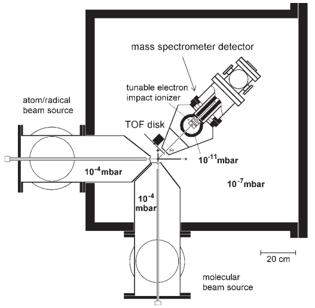

## Introduction

Crossed molecular beams experiments are designed to provide single-collision conditions for molecular reactions while also gathering dynamical information from it. An example setup from Preugia is shown in the figure to the right, from https://doi.org/10.1080/01442350600641305.
