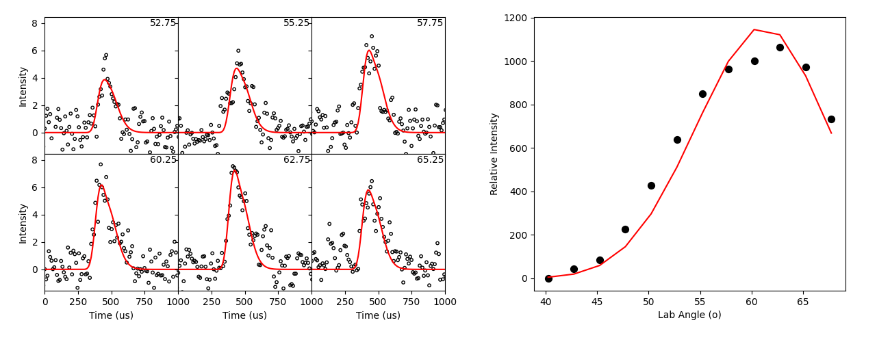

## Introduction


<p align="justify">
Crossed molecular beams experiments are designed to provide single-collision conditions for molecular reactions while also gathering dynamical information from it. GMTHRASHpy is designed to process this dynamical information to get center-of-mass information on the reactions. An crossed molecular beams setup from Perugia is shown in the figure to the right, from https://doi.org/10.1080/01442350600641305.
</p>

These kind of setups can be used to study a vast number of elementary gas-phase bimoelcular reactions. For example, consider the reaction below:

$$
\textrm{CH} + \textrm{C}_4 \textrm{H}_6 \longrightarrow \textrm{C}_5 \textrm{H}_6 + \textrm{H}
$$

<p align="justify">
The primary and secondary beams can be setup to produce CH and C<sub>4</sub>H<sub>6</sub>, and then the detector's mass-to-charge ratio of 66 can be scanned for any product formation. Any measurement in the device is result of a long chain of events, namely: (1) a collision reacts and then dissociate to products, (2) the product flies in the direction of the detector, and (3) finally, the product successfully ionizes without fragmenting.
  
When the detector in the experiment is callibrated to pick up on different speeds for the same detected mass, time-of-flight distributions can be gathered which give an insight into how much translational energy products have after dissociating. An example for the reaction above is shown here:
</p>



<p align="justify">
where the black circles are the experimental raw data. To get a "simulated" fit, like the red line shown above, a long series of physical transformations have to be done to obtain the proper number and distribution of product velocities in what is called a "forward convolution". GMTHRASHpy does this convolution, using a candidate center-of-mass function to describe the reaction, and transforming that forward to get these set of lab intensities.
</p>

## Usage

From a terminal, using the command line interface (CLI) is usually easier. First, create a PAN input file that describes your experimental setup and data, like so:

<details>
  
<summary>Header portion of CH+C4H6.pan</summary>

```text
ch + c4h6 -> 
00001010110211
13 9 5 5
90.  1.6   0.8
0

18.4 12.0
8 9.5

13 54
1

65
3 0

1
0
-0.3

0.65 5.0 15 0


12  2500
0.1 0.1
```
</details>

and then give it to `GMTHRASH_cli.py` as an argument, like so:
```
python GMTHRASH_cli.py CH+C4H6.pan
```

this produces the figure in the Introduction as well as the candidate center-of-mass (CM) functions.

